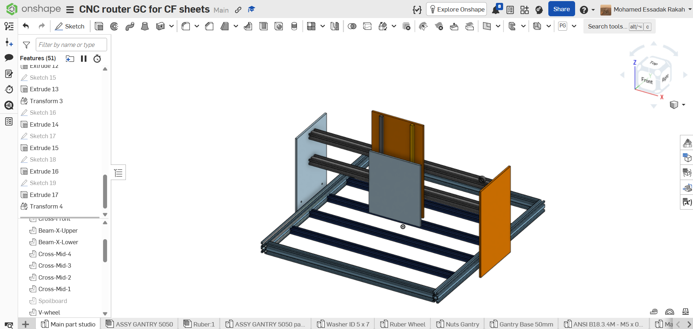
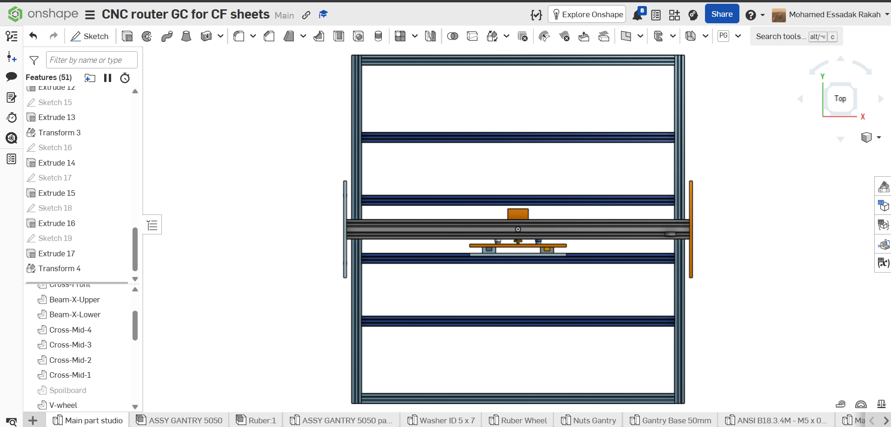
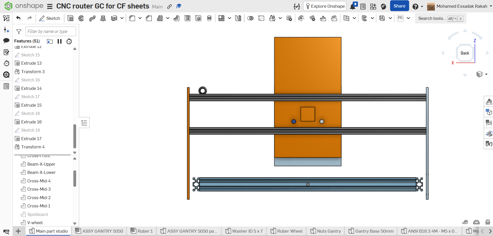
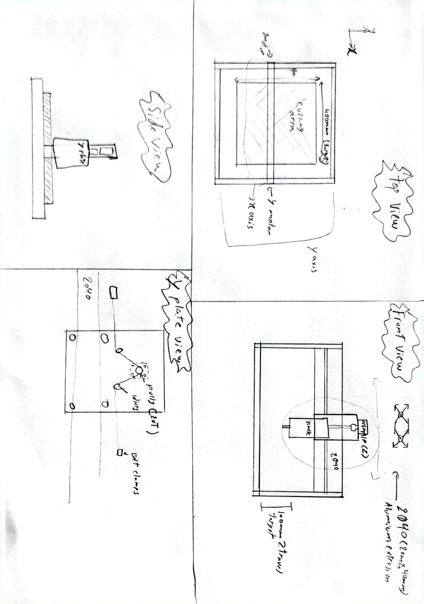
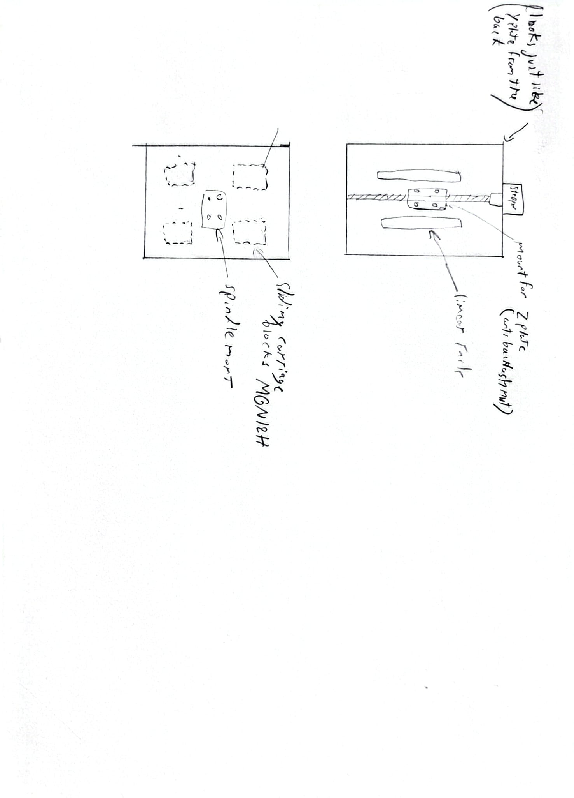

# CNC Router — UMass Aeronautics

Getting the Airframe Structures team off manual carbon fiber cutting.

## Why

Every CF sheet on our DBF aircraft was being cut by hand. Slow, inconsistent from person to person, and on a competition timeline the cut quality was starting to limit how good the parts could be. I took on finding us a better way.

## Designing one

I started by designing a router around what we needed:

- 400 × 400 mm cutting area
- Dual 2040 extrusion gantry, GT2 belt and V-wheels on X/Y, T8 lead screw on Z
- Makita RT0701CR spindle
- GRBL on an Arduino Uno with a CNC Shield V3
- MeanWell LRS-350-24 supply

Frame geometry is done in Onshape. BOM landed around $742 at [Rev 4a](design/bom-rev-4a.csv). I wrote a Python script to generate the drawing sheets parametrically so dimensions stayed in sync with the model instead of drifting every time I changed something.





Working drawings:




## Then the scope grew

The machine was no longer just for flat CF sheet. It also had to trim 3D-printed fuselage halves, cut hatches and wing sections, and handle CF-over-foam sandwich panels.

Fuselage halves are about 127 mm across. That pushed the working height requirement from 100 mm to roughly 160 mm, which my locked spec didn't cover. I added a plywood torsion box riser to the design to get the gantry up another 60–80 mm.

## Build vs. buy

Around the same time a used FoxAlien Masuter Pro came up locally for about $400, roughly half my BOM, already assembled and already cutting.

My design was better matched to what we needed. It was also going to cost more and take weeks the team didn't have before they needed parts. The Masuter Pro gets us cutting now and can be modified for the height we need.

I went with buying it. The design work is still here. Doing that work is what told me what to look for in a machine, and the modifications will come straight out of it.

## Where it is now

- **Machine pickup and first look** — coming soon
- **First cuts and results** — coming soon
- **Modifications** — TBD. Most likely Z clearance and workholding.

## In this repo

```
images/     CAD screenshots, machine photos
design/     drawing sheets, the Python that generates them, and the BOM
```

## Open questions

- Z plate material: machined aluminum vs. printed PETG as an interim
- Plate nesting and stock strategy, to confirm with our advisor
- Assumption register to revisit before ordering: Makita collet offset, V-wheel OD, pulley heights
