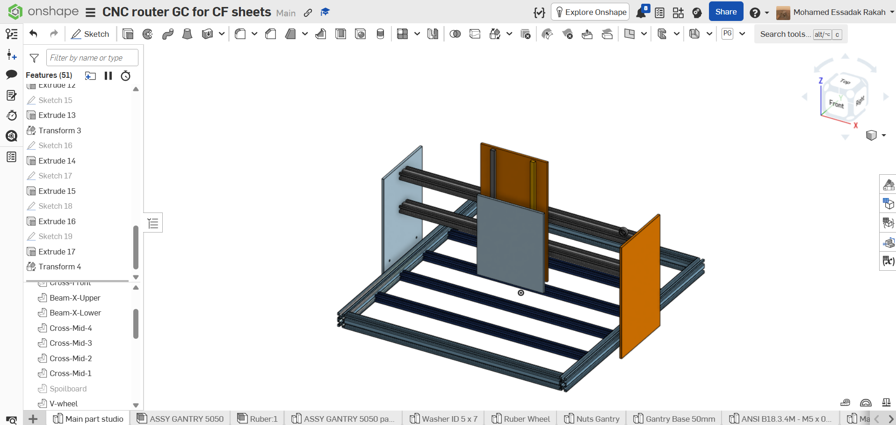
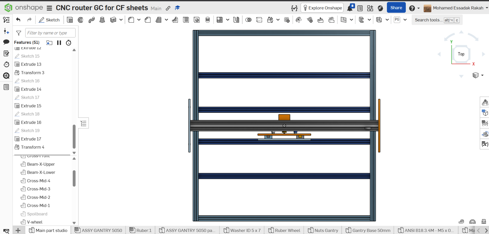
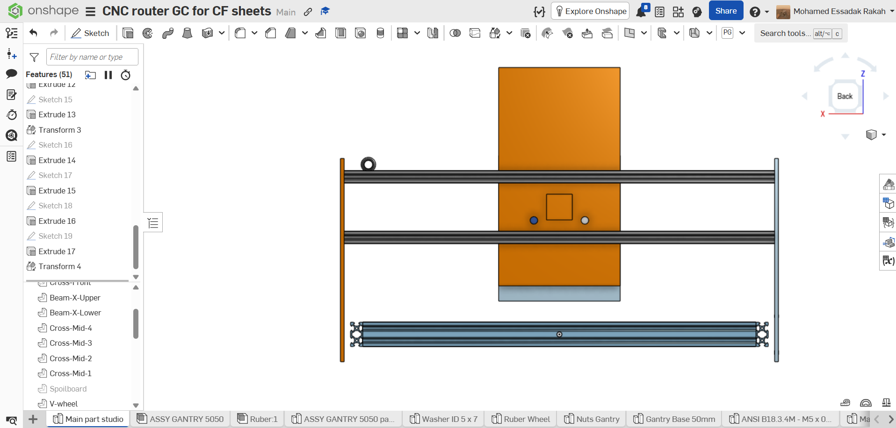
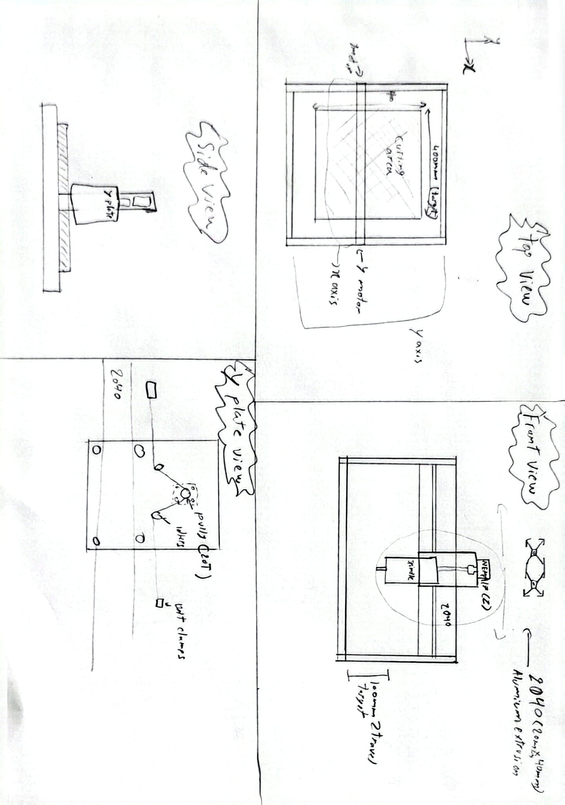
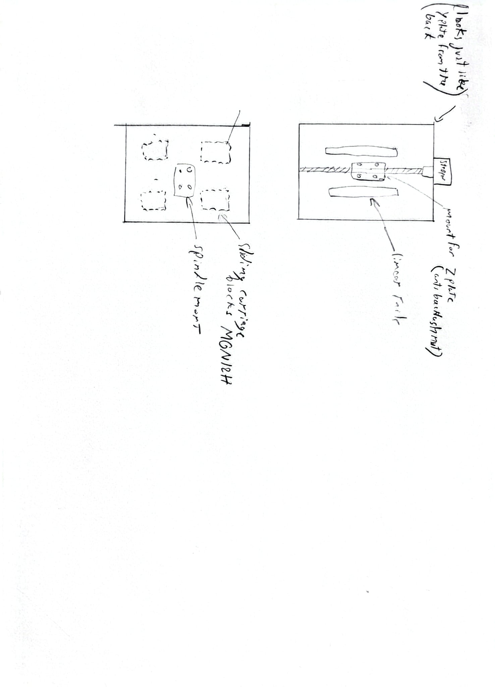
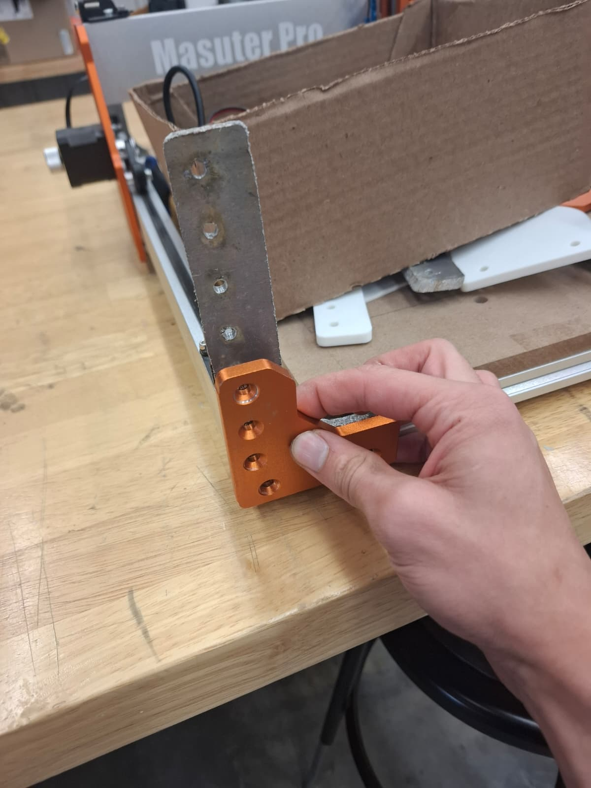
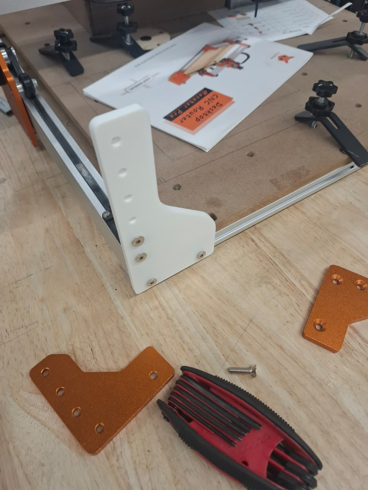
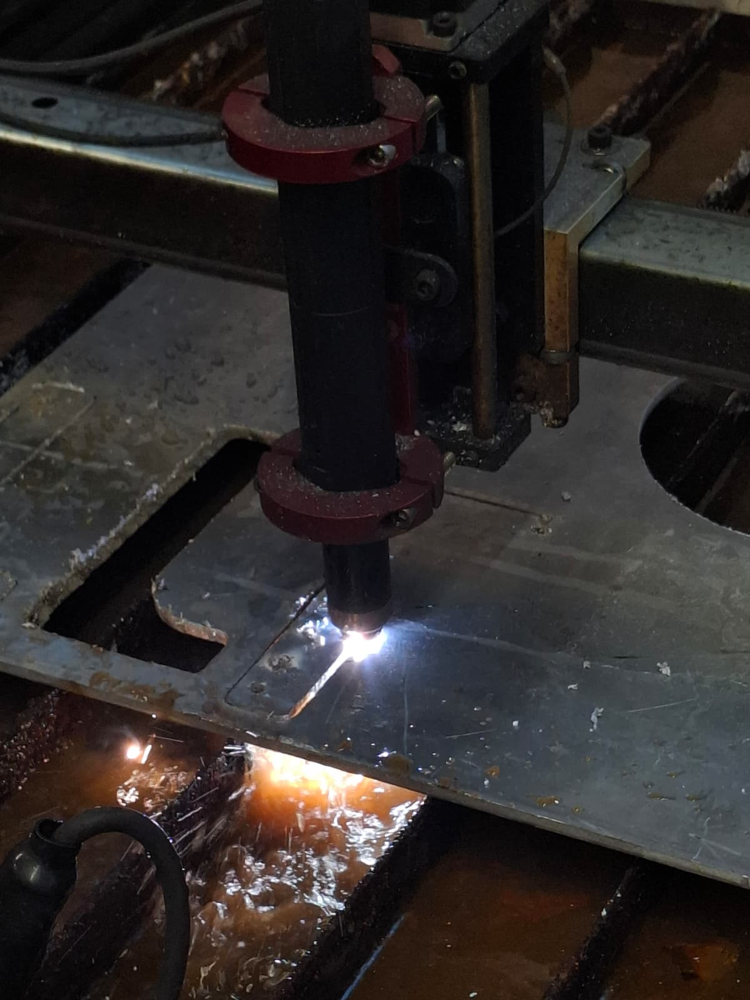
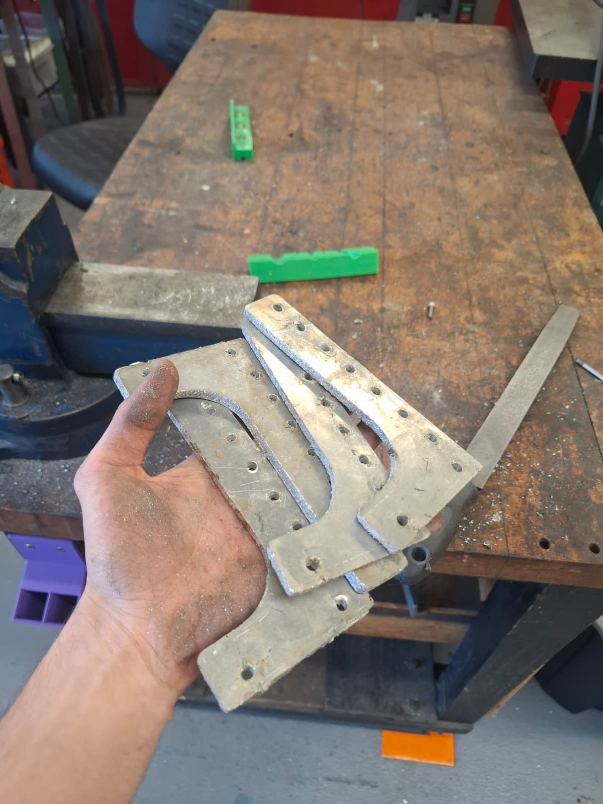

# CNC Router — UMass Aeronautics

Getting the Airframe Structures team off manual carbon fiber cutting.


## Why

Every CF sheet on our DBF aircraft was being cut by hand. Slow, inconsistent from person to person, and on a competition timeline the cut quality was starting to limit how good the parts could be. I took on finding us a better way.

## Designing one

I started by designing a router around what we needed:

- 400 × 400 mm cutting area
- Dual 2040 extrusion gantry, GT2 belt and V-wheels on X/Y, T8 lead screw on Z
- Makita RT0701CR spindle
- GRBL on an Arduino Uno with a CNC Shield V3
- MeanWell LRS-350-24 supply

Frame geometry is done in Onshape. BOM landed around $742 at [Rev 4a](design/bom-rev-4a.csv). I wrote a Python script to generate the drawing sheets parametrically so dimensions stayed in sync with the model instead of drifting every time I changed something.

  

Working drawings:

 

## Then the scope grew

The machine was no longer just for flat CF sheet. It also had to trim 3D-printed fuselage halves, cut hatches and wing sections, and handle CF-over-foam sandwich panels.

Fuselage halves are about 127 mm across. That pushed the working height requirement from 100 mm to roughly 160 mm, which my locked spec didn't cover. I added a plywood torsion box riser to the design to get the gantry up another 60–80 mm.

## Build vs. buy

Around the same time a used FoxAlien Masuter Pro came up locally for about $400, roughly half my BOM, already assembled and already cutting.

My design was better matched to what we needed. It was also going to cost more and take weeks the team didn't have before they needed parts. The Masuter Pro gets us cutting now and can be modified for the height we need.

I went with buying it. The design work is still here. Doing that work is what told me what to look for in a machine, and the modifications come straight out of it.

## First cuts

Bought, brought back, and cutting.

<p align="center">
  
</p>

📹 [Masuter Pro running](images/MasuterPro-workinh.mp4)

## Modification 1: raising the gantry

Out of the box, the Masuter Pro doesn't have the clearance for our fuselage halves. Instead of building a riser under the whole machine, I designed new plates that lift the Y beams, and everything mounted on them, by TBD mm.

**Process:**

1. **CAD** — new plates designed in Onshape around the Masuter Pro's existing mounting holes.
2. **Test fit in PLA** — printed the plates first to check hole positions and fit before cutting metal.
3. **Plasma cut** — cut from 1/4" aluminum in the makerspace.
4. **Drill press** — holes drilled to final size.

<p align="center">
  
</p>

<p align="center">
  
  
</p>

<p align="center">
  
</p>

📹 [Drilling the plates](images/pressdrill.mp4)

## Where it is now

- [x] Designed a router from scratch (BOM, CAD, drawings)
- [x] Bought a used Masuter Pro instead, and documented why
- [x] First cuts
- [x] Riser plates designed, test-fit in PLA, plasma cut, and drilled
- [ ] Plates installed and machine re-squared
- [ ] First CF cuts
- [ ] Dust shoe (3D printed), to work with the team's existing vacuum
- [ ] Spindle: switch to a cheaper 65 mm spindle instead of the Makita

## In this repo

```
images/     CAD screenshots, machine photos, modification photos
design/     drawing sheets, the Python that generates them, and the BOM
```

## Open questions

- Workholding for curved fuselage halves vs. flat CF sheet
- Plate nesting and stock strategy, to confirm with our advisor

*The original open items (Z plate material, Makita collet offset, V-wheel OD, pulley heights) applied to the from-scratch design and are closed now that we bought the Masuter Pro.*
